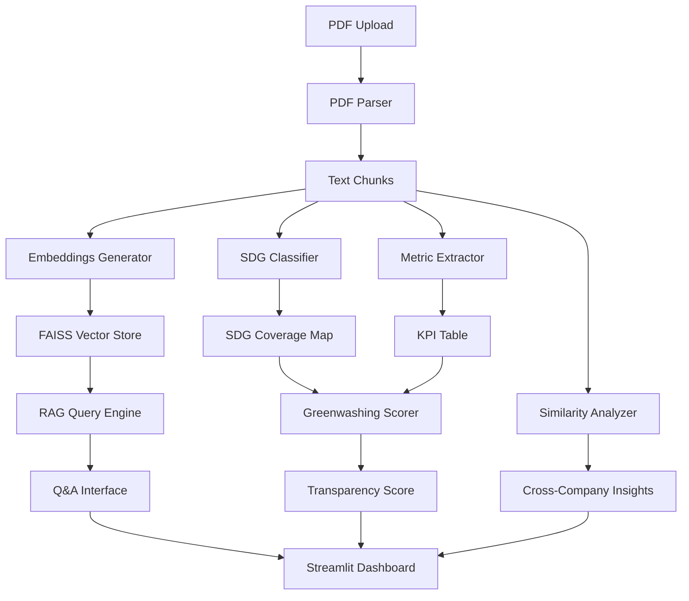

# ESG TruthBot — System Architecture

## High-Level Design

## Component Responsibilities

### 1. PDF Parser
- **Input**: PDF files (ESG reports)
- **Output**: Text chunks with metadata (source, page, chunk_id)
- **Method**: PyMuPDF for extraction, sliding window chunking (~300 words, 50-word overlap)

### 2. Embeddings & Vector Store
- **Model**: sentence-transformers/all-MiniLM-L6-v2 (384-dim embeddings)
- **Store**: FAISS for efficient similarity search
- **Purpose**: Enable semantic retrieval for RAG

### 3. RAG Query Engine
- **Input**: User question (natural language)
- **Output**: Top-k relevant chunks across all loaded reports
- **Method**: Embed query → cosine similarity search in FAISS

### 4. SDG Classifier
- **Model**: facebook/bart-large-mnli (zero-shot)
- **Labels**: 17 UN SDGs + descriptions
- **Output**: Per-chunk SDG predictions with confidence scores

### 5. Metric Extractor
- **Tool**: spaCy en_core_web_sm + custom patterns
- **Target Entities**: Emissions (CO2e), percentages, currency, dates
- **Classification**: Target vs. Actual vs. Vague ("plans to", "commits to")

### 6. Similarity Analyzer
- **Method**: Cosine similarity between company embeddings for same SDG
- **Use Case**: "Company A and B both claim carbon neutrality — how similar are their commitments?"

### 7. Greenwashing Scorer
- **Inputs**: SDG claims, extracted metrics, language vagueness
- **Logic**:
  - Claims with quantified metrics → higher transparency
  - Vague language without targets → lower transparency
- **Output**: Score 0-100 per SDG

## Design Decisions

### Why Local Models?
- No API costs or rate limits
- Reproducible for academic evaluation
- Privacy-preserving (reports stay local)

### Why FAISS over Vector DBs?
- Lightweight, suitable for POC scale
- No server setup required
- Fast enough for demo with <1000 chunks

### Why Zero-Shot for SDGs?
- No labeled training data available
- BART-large-mnli generalizes well to sustainability domain
- Faster development than fine-tuning

## Future Enhancements (Out of Scope)
- Fine-tuned SDG classifier on labeled ESG corpus
- LLM integration for natural language explanations
- Temporal analysis (year-over-year progress tracking)
- Multi-language support
